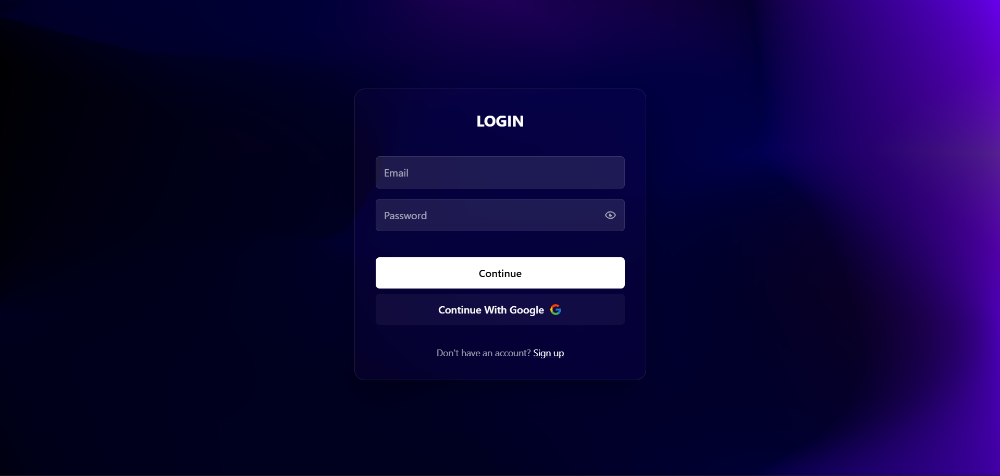
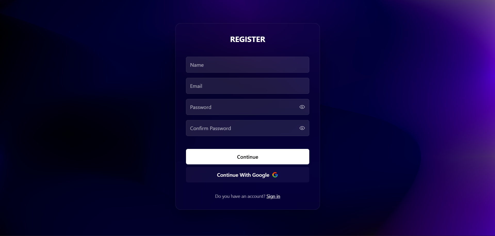
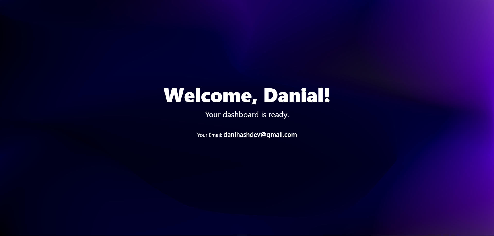

# Auth Portal 🚀

---

## 🌟 About The Project

A modern full‑stack authentication system built with React on the frontend and Express/Node.js on the backend, featuring secure email/password login, Google OAuth integration, and session‑based authentication using cookies. This project includes protected routes, user registration and login flows, and a persistent session stored with express‑session, enabling users to authenticate and maintain sessions seamlessly across pages. It’s ideal as a starting point or boilerplate for web apps that need a robust and extensible authentication layer.

## 🔥 Key Features

| Feature                       | Description                                               | Status |
| ----------------------------- | --------------------------------------------------------- | ------ |
| **User Registration & Login** | Secure email/password authentication                      | ✅     |
| **Social Login**              | Sign in , register with Google                            | ✅     |
| **Audit Logs**                | Real-time logging of user activities and security events. | ✅     |

---

## 🛠️ Tech Stack

### Frontend

- **React 19**
- **Tailwind CSS** for utility-first styling
- **React Router** for routing
- **Axios** for API calls

### Backend

- **Node.js** (v18+)
- **Express.js** as the web framework
- **SQL**
- **JSON Web Tokens (JWT)** for authentication

---

## 🚀 Getting Started

### Prerequisites

Make sure you have the following installed on your machine:

- **Node.js** (v18.x or higher)
- **npm** or **yarn**
- **SQL** (local or cloud instance)

### Installation

1. **Clone the repository**

   ```bash
   git clone https://github.com/amir-khaksar/auth-portal.git
   cd auth-portal
   ```

2. **Install dependencies**

   ```bash
   # For frontend
   cd frontend
   npm install

   # For backend
   cd ../backend
   npm install
   ```

### Configuration

Create `.env` files in both `frontend` and `backend` directories.

#### Frontend `.env.development`

```env
VITE_API_BASE_URL=http://localhost:3000
```

#### Backend `.env`

```env
CLIENT_ID=3011637808-6m4v7d1klr64bn4025imj40ot39rapts.apps.googleusercontent.com
CLIENT_SECRET=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
CLIENT_URL=http://localhost:5173/dashboard
SESSION_SECRET=;fjoiwjein,mcla;dj;lkhg
PORT=3000
```

> 🔐 **Important**: Never commit `.env` files to version control. They are already in `.gitignore`.

### Running the Project

#### Option 1: Local Development

```bash
# Start backend (port 3000)
cd backend
npm run dev

# In another terminal, start frontend (port 3000)
cd ../frontend
npm run dev
```

Access the app at:

- **Frontend**: http://localhost:5173
- **Backend API**: http://localhost:3000

---

## 📸 Screenshots & Demo

### Login Page



### Register



### Dashboard



## 👥 Creators

Auth Portal is proudly developed and maintained by these amazing contributors:

### **Amir Khaksar**

🔹 **GitHub**: [@amir-khaksar](https://github.com/amir-khaksar)

---

### **Danial Hajhashemkhani**

🔹 **GitHub**: [@daniHash](https://github.com/danihash)

---
